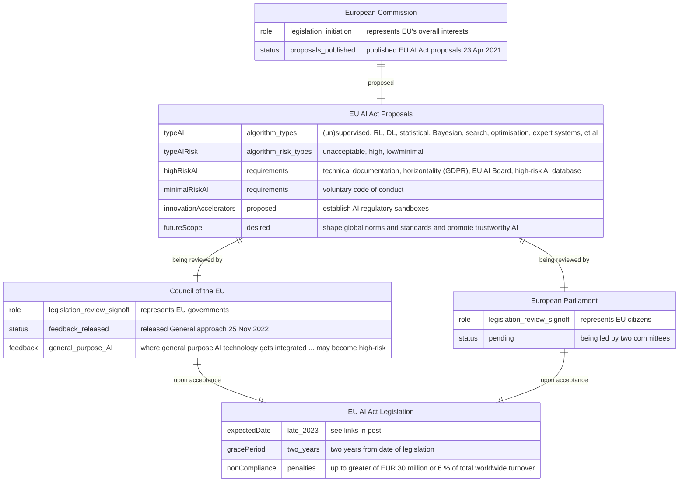

```mermaid

erDiagram

    "European Commission" {
        role    legislation_initiation "represents EU's overall interests"
        status  proposals_published "published EU AI Act proposals 23 Apr 2021"
    }
    "EU AI Act Proposals"{
        typeAI algorithm_types "(un)supervised, RL, DL, statistical, Bayesian, search, optimisation, expert systems, et al"
        typeAIRisk algorithm_risk_types "unacceptable, high, low/minimal"
        highRiskAI  requirements "technical documentation, horizontality (GDPR), EU AI Board, high-risk AI database"
        minimalRiskAI  requirements "voluntary code of conduct"
        innovationAccelerators    proposed "establish AI regulatory sandboxes" 
        futureScope     desired "shape global norms and standards and promote trustworthy AI"
    }
    "Council of the EU"{
        role legislation_review_signoff "represents EU governments"
        status feedback_released "released General approach 25 Nov 2022"
        feedback general_purpose_AI "where general purpose AI technology gets integrated ... may become high-risk"
    }
    "European Parliament"{
        role legislation_review_signoff "represents EU citizens"
        status  pending "being led by two committees" 
    }
    "EU AI Act Legislation" {
        expectedDate late_2023   "see links in post" 
        gracePeriod  two_years   "two years from date of legislation" 
        nonCompliance penalties "up to greater of EUR 30 million or 6 % of total worldwide turnover"
    }
    
    "European Commission" ||--|| "EU AI Act Proposals" :"proposed"
    "EU AI Act Proposals" ||--|| "Council of the EU" : "being reviewed by"
    "EU AI Act Proposals" ||--|| "European Parliament" : "being reviewed by"
    "Council of the EU" ||--|| "EU AI Act Legislation" :"upon acceptance"
    "European Parliament" ||--|| "EU AI Act Legislation" : "upon acceptance"
  
```